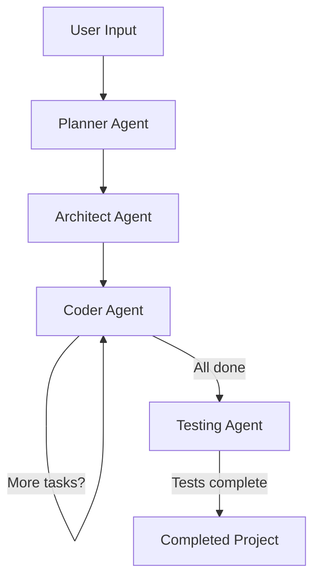

# 🛠️ Coder Buddy

**Coder Buddy** is an AI-powered coding assistant built with [LangGraph](https://github.com/langchain-ai/langgraph).  
It works like a multi-agent development team that can take a natural language request and transform it into a complete, working project — file by file — using real developer workflows.

---

## 🏗️ Architecture

- **Planner Agent** – Analyzes your request and generates a detailed project plan.
- **Architect Agent** – Breaks down the plan into specific engineering tasks with explicit context for each file.
- **Coder Agent** – Implements each task, writes directly into files, and uses available tools like a real developer.

---

## 🚀 Getting Started

### Prerequisites
- Make sure you have [uv](https://docs.astral.sh/uv/getting-started/installation/) installed
- Ensure that you have created a [Groq](https://console.groq.com/keys) account and have your API key ready

### Installation and Startup
1. Create a virtual environment using: `uv venv` and activate it using `source .venv/bin/activate`
2. Install the dependencies using: `uv pip install -r pyproject.toml`
3. Create a `.env` file and add the variables and their respective values mentioned in the `.sample_env` file

Now that we are done with all the set-up & installation steps we can start the application using the following command:
```bash
python main.py
```

### 🧪 Example Prompts
- Create a to-do list application using html, css, and javascript.
- Create a simple calculator web application.
- Create a simple blog API in FastAPI with a SQLite database.

---

## 🔧 How It Works

### Multi-Agent Architecture
Coder Buddy uses three specialized AI agents working in sequence:

1. **Planner Agent** 🧠
   - Takes your natural language request and creates a structured project plan
   - Example: "Create a todo app" → breaks it down into features, tech stack, file structure

2. **Architect Agent** 🏗️
   - Takes the plan and creates detailed implementation tasks
   - Specifies exactly which files to create and what each should contain
   - Uses structured output (Pydantic models) for precise task definitions

3. **Coder Agent** 💻
   - Implements each task one by one
   - Reads existing files, makes modifications, writes new files
   - Uses actual file system tools (read_file, write_file, list_files, get_current_directory)
   - Continues until all implementation steps are marked as DONE

### Workflow Flow


### Key Technologies
- **LangGraph**: For building the agent workflow/state machine
- **LangChain Groq**: LLM integration using Groq's fast inference
- **Pydantic**: For structured agent outputs
- **Python**: Core implementation language
- **uv**: Fast Python package installer/manager

---

## 🧪 Testing Extension

Coder Buddy now includes an automated testing phase that runs after code generation to verify the produced project works correctly.

### How Testing Works
1. After the Coder Agent completes all implementation tasks
2. The **Test Agent** automatically:
   - Detects the project type based on file extensions and configuration files
   - Runs the appropriate test suite:
     - **Python projects**: Uses `pytest` (falls back to `python -m unittest discover -v`)
     - **Node.js projects**: Runs `npm test`
     - **Rust projects**: Executes `cargo test`
     - **Fallback**: Scans for source files to infer test framework
   - Captures test output (stdout/stderr) and pass/fail status
   - Stores results in the agent state for potential future use (e.g., fixing failures)

### Benefits
- ✅ **Immediate Validation**: Know if generated code actually works
- ✅ **Quality Assurance**: Catch syntax/runtime errors before delivery
- ✅ **Learning Opportunity**: See testing practices in generated projects
- ✅ **Professional Standard**: Projects include test validation by default
- ✅ **Extensible Foundation**: Easy to add more test frameworks or integrate with CI/CD

---

## 📁 Project Structure
```
coder-buddy-main/
├── agent/                 # Core AI agent implementation
│   ├── __init__.py
│   ├── prompts.py
│   ├── states.py
│   └── tools.py
├── main.py               # Application entry point
├── pyproject.toml        # Project dependencies
├── README.md             # Project documentation
├── .sample_env           # Sample environment file
└── uv.lock               # Dependency lock file
```

---

## 📝 Key Components Explained

### `main.py`
- Simple CLI interface that takes user input and runs the agent workflow
- Accepts a `--recursion-limit` parameter to control how many steps the agent can take
- Handles errors and keyboard interrupts gracefully

### `agent/graph.py`
- Defines the LangGraph state machine with four nodes: planner → architect → coder → tester
- Implements the core logic where each agent passes its output to the next
- Uses conditional routing to loop the coder agent until all tasks are complete, then proceeds to testing

### `agent/tools.py`
- Provides the actual file system capabilities the coder agent uses:
  - `write_file`: Create or update files
  - `read_file`: Examine existing files
  - `list_files`: See what's in a directory
  - `get_current_directory`: Get working directory
  - `run_cmd`: Execute shell commands (for running tests, etc.)
  - **NEW** `run_tests`: Automatically detects project type and runs appropriate test suite

### `agent/prompts.py`
- Contains the specialized prompts that guide each agent's behavior
- Planner prompt: Focuses on understanding requirements and making plans
- Architect prompt: Focuses on breaking plans into concrete implementation tasks
- Coder prompt: Focuses on writing actual code to fulfill specific tasks

### `agent/states.py`
- Defines the Pydantic data structures that ensure type safety between agents:
  - `Plan`: High-level project plan from the planner
  - `TaskPlan`: Detailed implementation tasks from the architect
  - `CoderState`: Tracks progress through implementation steps
  - **NEW** `TestResult`: Captures test execution outcomes (pass/fail, output, details)

---

## 🛠️ Extensibility
The system is designed to be extended:
- Add new tools to `agent/tools.py` (e.g., for linting, formatting, or deployment)
- Modify prompts in `agent/prompts.py` to change how agents think
- Extend the state models in `agent/states.py` to capture more complex project metadata
- Enhance the testing logic in `run_tests()` to support additional frameworks or generate test files

This architecture allows Coder Buddy to handle increasingly complex software projects while maintaining clear separation of concerns between planning, architecture, implementation, and verification.

---